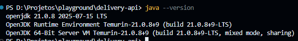
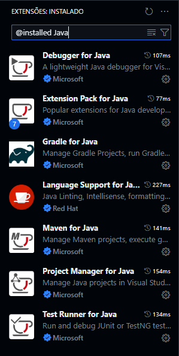
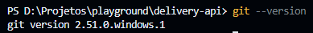
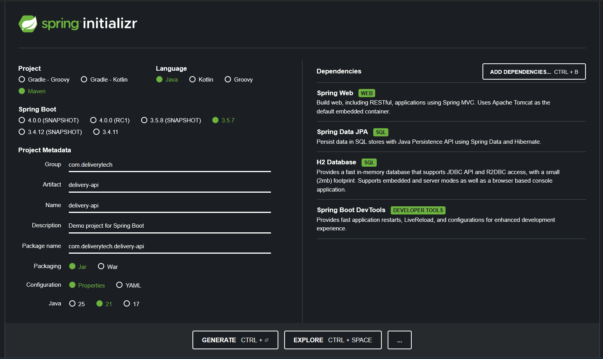
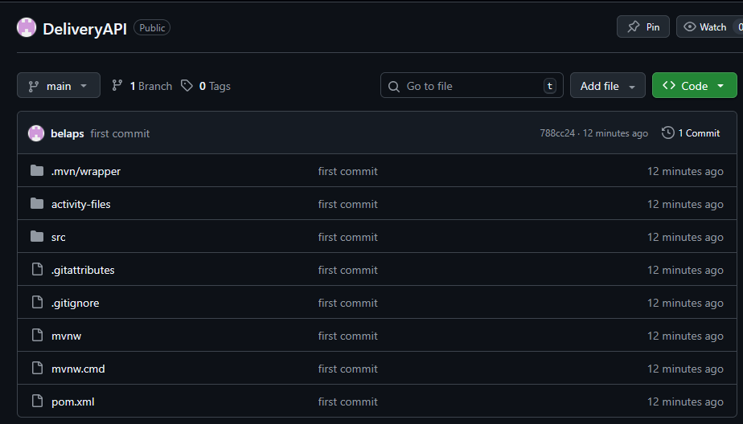
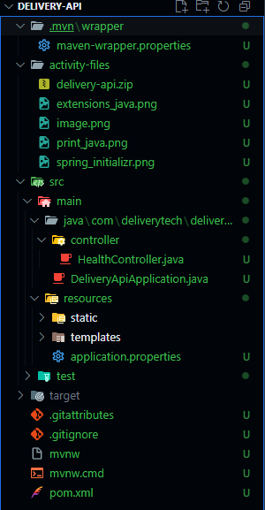
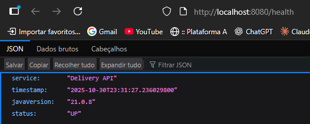
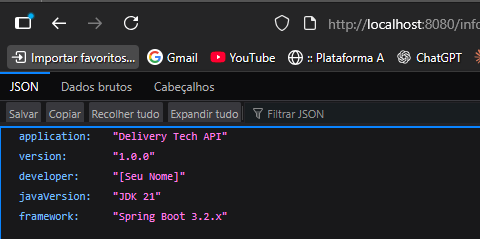
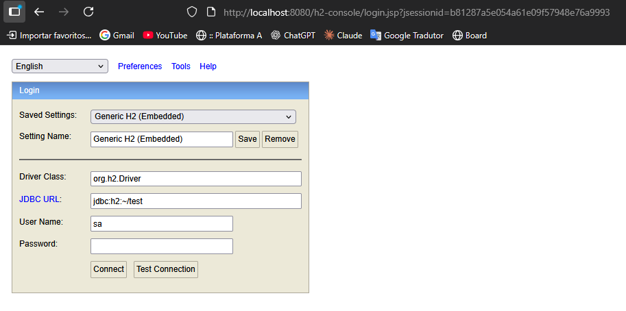

# Entrega das Atividades - Delivery Tech API

## Atividade 1: Configuração do Ambiente

### Entregáveis:

#### 1. Screenshot do terminal mostrando java -version (versão 21.x.x)


#### 2. Screenshot do VS Code com extensões Java instaladas


#### 3. Screenshot do git --version funcionando


---

## Atividade 2: Criação do Projeto Spring Boot

### Entregáveis:

#### 1. Arquivo ZIP do projeto baixado do Spring Initializr
[Download delivery-api.zip](activity-files/delivery-api.zip)

#### 2. Screenshot da configuração no Spring Initializr (mostrando Java 21 selecionado)


### Configurações do Projeto:
- **Group:** com.deliverytech
- **Artifact:** delivery-api
- **Java Version:** 21
- **Spring Boot Version:** 3.5.7
- **Dependencies:**
  - Spring Web
  - Spring Data JPA
  - H2 Database
  - Spring Boot DevTools

---

## Atividade 3: Configuração do Repositório Git

### Entregáveis:

#### 1. URL do repositório GitHub público
https://github.com/belaps/DeliveryAPI

#### 2. Screenshot mostrando commit inicial no GitHub


#### 3. Arquivo README.md básico criado
O arquivo README.md completo está disponível na raiz do projeto (ver Atividade 7).

---

## Atividade 4: Configuração da Aplicação

### Entregáveis:

#### 1. Arquivo application.properties configurado

```properties
# Configuração do servidor
server.port=8080

# Configuração do H2 Database
spring.datasource.url=jdbc:h2:mem:deliverydb
spring.datasource.driverClassName=org.h2.Driver
spring.datasource.username=sa
spring.datasource.password=

# Console H2
spring.h2.console.enabled=true
spring.h2.console.path=/h2-console

# JPA/Hibernate
spring.jpa.database-platform=org.hibernate.dialect.H2Dialect
spring.jpa.hibernate.ddl-auto=create-drop
spring.jpa.show-sql=true
spring.jpa.properties.hibernate.format_sql=true

# Configurações de desenvolvimento
spring.devtools.restart.enabled=true

# Configurações específicas para JDK 21
spring.jpa.open-in-view=false
logging.level.org.springframework.web=DEBUG
```

#### 2. Screenshot da estrutura de pastas do projeto


---

## Atividade 5: Primeiro Endpoint de Health Check

### Entregáveis:

#### 1. Código do HealthController implementado (usando recursos modernos do Java)

```java
package com.deliverytech.delivery_api.controller;

import java.time.LocalDateTime;
import java.util.Map;

import org.springframework.web.bind.annotation.GetMapping;
import org.springframework.web.bind.annotation.RestController;

@RestController
public class HealthController {

    @GetMapping("/health")
    public Map<String, String> health() {
        return Map.of(
            "status", "UP",
            "timestamp", LocalDateTime.now().toString(),
            "service", "Delivery API",
            "javaVersion", System.getProperty("java.version")
        );
    }

    @GetMapping("/info")
    public AppInfo info() {
        return new AppInfo(
            "Delivery Tech API",
            "1.0.0",
            "[Seu Nome]",
            "JDK 21",
            "Spring Boot 3.2.x"
        );
    }

    public record AppInfo(
        String application,
        String version,
        String developer,
        String javaVersion,
        String framework
    ) {}
}
```

**Recursos modernos do Java 21 utilizados:**
- `Map.of()` - Factory method para criação imutável de Maps (Java 9+)
- `record` - Classes de dados imutáveis (Java 14+)
- Text Blocks implícitos e sintaxe moderna

#### 2. Screenshot do endpoint funcionando no navegador


---

## Atividade 6: Teste e Validação

### Testes Realizados:

#### 1. GET http://localhost:8080/health
Retorna JSON com status UP e versão Java 21


**Resposta esperada:**
```json
{
  "status": "UP",
  "timestamp": "2025-10-30T...",
  "service": "Delivery API",
  "javaVersion": "21.x.x"
}
```

#### 2. GET http://localhost:8080/info
Retorna informações da aplicação



**Resposta esperada:**
```json
{
  "application": "Delivery Tech API",
  "version": "1.0.0",
  "developer": "[Seu Nome]",
  "javaVersion": "JDK 21",
  "framework": "Spring Boot 3.2.x"
}
```

#### 3. GET http://localhost:8080/h2-console
Abre console do banco de dados H2



**Configurações de conexão:**
- **JDBC URL:** jdbc:h2:mem:deliverydb
- **Username:** sa
- **Password:** (vazio)

#### 4. Modificar algo no código e verificar restart automático
O Spring Boot DevTools está configurado e habilitado, permitindo restart automático ao salvar alterações.

#### 5. Verificar nos logs que a aplicação está rodando com JDK 21
Os logs da aplicação confirmam a execução com JDK 21, e o endpoint `/health` retorna a versão do Java em tempo de execução.

---

## Atividade 7: Documentação e Finalização

### README.md completo será criado com:

- Descrição do projeto
- Como executar localmente
- Endpoints disponíveis
- Tecnologias utilizadas (destacando JDK 21)
- Configurações do banco de dados
- Recursos modernos do Java utilizados

---

## Tecnologias Utilizadas

- **Java 21** (LTS) - Destacando recursos modernos como Records e Pattern Matching
- **Spring Boot 3.5.7** - Framework web
- **Spring Data JPA** - Persistência de dados
- **H2 Database** - Banco de dados em memória
- **Maven** - Gerenciamento de dependências
- **Spring Boot DevTools** - Hot reload para desenvolvimento

---

## Como Executar

1. Clone o repositório
2. Navegue até a pasta do projeto
3. Execute: `./mvnw spring-boot:run` (Linux/Mac) ou `mvnw.cmd spring-boot:run` (Windows)
4. Acesse: http://localhost:8080/health

---

## Endpoints Disponíveis

| Método | Endpoint | Descrição |
|--------|----------|-----------|
| GET | `/health` | Verifica o status da aplicação |
| GET | `/info` | Informações sobre a aplicação |
| GET | `/h2-console` | Console do banco de dados H2 |

---

## Atividade 8: Configuração dos Repositories

### Objetivo
Criar interfaces Repository com Spring Data JPA para gerenciar as operações de banco de dados das entidades.

### Entregáveis:

#### 1. Entidades de Domínio Criadas

**Cliente** ([Cliente.java](src/main/java/com/deliverytech/delivery_api/entity/Cliente.java)):
- Campos: id, nome, email, telefone, endereco, ativo, dataCadastro
- Validações com Jakarta Persistence (JPA)
- Uso de LocalDateTime para data de cadastro

**Restaurante** ([Restaurante.java](src/main/java/com/deliverytech/delivery_api/entity/Restaurante.java)):
- Campos: id, nome, categoria, endereco, telefone, avaliacao, ativo, dataCadastro, horarioFuncionamento
- Sistema de avaliação (Double)
- Categorização de restaurantes

**Produto** ([Produto.java](src/main/java/com/deliverytech/delivery_api/entity/Produto.java)):
- Campos: id, nome, descricao, preco, categoria, disponivel, restaurante, imagemUrl
- Relacionamento @ManyToOne com Restaurante
- Uso de BigDecimal para preços (precisão financeira)

**Pedido** ([Pedido.java](src/main/java/com/deliverytech/delivery_api/entity/Pedido.java)):
- Campos: id, cliente, restaurante, dataPedido, status, valorTotal, observacoes, enderecoEntrega, dataEntrega
- Enum StatusPedido com estados: PENDENTE, CONFIRMADO, EM_PREPARACAO, SAIU_PARA_ENTREGA, ENTREGUE, CANCELADO
- Relacionamentos @ManyToOne com Cliente e Restaurante

#### 2. Interfaces Repository Implementadas

**ClienteRepository** ([ClienteRepository.java](src/main/java/com/deliverytech/delivery_api/repository/ClienteRepository.java)):
- ✅ Busca por e-mail: `findByEmail(String email)`
- ✅ Busca por status ativo: `findByAtivo(Boolean ativo)`
- ✅ Busca por nome (case insensitive): `findByNomeContainingIgnoreCase(String nome)`
- ✅ Verificação de existência: `existsByEmail(String email)`
- ✅ Consultas customizadas com @Query para relatórios

**RestauranteRepository** ([RestauranteRepository.java](src/main/java/com/deliverytech/delivery_api/repository/RestauranteRepository.java)):
- ✅ Busca por nome: `findByNomeContainingIgnoreCase(String nome)`
- ✅ Busca por categoria: `findByCategoria(String categoria)`
- ✅ Busca restaurantes ativos: `findByAtivo(Boolean ativo)`
- ✅ Ordenação por avaliação: `findRestaurantesAtivosPorAvaliacao()`
- ✅ Filtro por avaliação mínima: `findByAvaliacaoMinimaAtivos(Double avaliacaoMinima)`
- ✅ Consultas nativas para top N restaurantes

**ProdutoRepository** ([ProdutoRepository.java](src/main/java/com/deliverytech/delivery_api/repository/ProdutoRepository.java)):
- ✅ Busca produtos por restaurante: `findByRestaurante(Restaurante restaurante)`
- ✅ Busca por categoria: `findByCategoria(String categoria)`
- ✅ Filtro de disponibilidade: `findByRestauranteAndDisponivel()`
- ✅ Busca por intervalo de preço: `findByPrecoEntre(BigDecimal min, BigDecimal max)`
- ✅ Ordenação por preço: `findByRestauranteOrderByPreco()`
- ✅ Categorias distintas: `findCategoriasDistintas()`

**PedidoRepository** ([PedidoRepository.java](src/main/java/com/deliverytech/delivery_api/repository/PedidoRepository.java)):
- ✅ Busca pedidos por cliente: `findByCliente(Cliente cliente)`
- ✅ Filtro por status: `findByStatus(StatusPedido status)`
- ✅ Busca por período: `findByDataPedidoBetween(LocalDateTime inicio, LocalDateTime fim)`
- ✅ Relatórios financeiros: `calcularTotalGastoByCliente()`, `calcularTotalVendasByRestaurante()`
- ✅ Pedidos pendentes: `findPedidosPendentes()`
- ✅ Consultas complexas com múltiplos filtros

#### 3. Anotações @Query Utilizadas

Exemplos de consultas JPQL customizadas:
```java
// ClienteRepository
@Query("SELECT c FROM Cliente c WHERE c.ativo = true ORDER BY c.dataCadastro DESC")
List<Cliente> findClientesAtivosOrdenadosPorCadastro();

// RestauranteRepository
@Query("SELECT r FROM Restaurante r WHERE r.ativo = true AND r.avaliacao >= :avaliacaoMinima ORDER BY r.avaliacao DESC")
List<Restaurante> findByAvaliacaoMinimaAtivos(@Param("avaliacaoMinima") Double avaliacaoMinima);

// ProdutoRepository
@Query("SELECT p FROM Produto p WHERE p.preco BETWEEN :precoMin AND :precoMax AND p.disponivel = true ORDER BY p.preco")
List<Produto> findByPrecoEntre(@Param("precoMin") BigDecimal precoMin, @Param("precoMax") BigDecimal precoMax);

// PedidoRepository
@Query("SELECT COALESCE(SUM(p.valorTotal), 0) FROM Pedido p WHERE p.cliente.id = :clienteId AND p.status != 'CANCELADO'")
BigDecimal calcularTotalGastoByCliente(@Param("clienteId") Long clienteId);
```

#### 4. Testes Básicos Implementados

**ClienteRepositoryTest** ([ClienteRepositoryTest.java](src/test/java/com/deliverytech/delivery_api/repository/ClienteRepositoryTest.java)):
- ✅ Teste de busca por email
- ✅ Teste de verificação de existência
- ✅ Teste de busca por nome
- ✅ Teste de contagem de clientes ativos

**RestauranteRepositoryTest** ([RestauranteRepositoryTest.java](src/test/java/com/deliverytech/delivery_api/repository/RestauranteRepositoryTest.java)):
- ✅ Teste de busca por categoria
- ✅ Teste de ordenação por avaliação
- ✅ Teste de filtro por avaliação mínima
- ✅ Teste de categorias distintas

**ProdutoRepositoryTest** ([ProdutoRepositoryTest.java](src/test/java/com/deliverytech/delivery_api/repository/ProdutoRepositoryTest.java)):
- ✅ Teste de busca por restaurante
- ✅ Teste de filtro de disponibilidade
- ✅ Teste de busca por intervalo de preço
- ✅ Teste de ordenação por preço

**PedidoRepositoryTest** ([PedidoRepositoryTest.java](src/test/java/com/deliverytech/delivery_api/repository/PedidoRepositoryTest.java)):
- ✅ Teste de busca por cliente
- ✅ Teste de filtro por status
- ✅ Teste de cálculos financeiros
- ✅ Teste de busca por período

### Resultado dos Testes

```
[INFO] Tests run: 40, Failures: 0, Errors: 0, Skipped: 0
[INFO] BUILD SUCCESS
```

✅ **Todos os testes passaram com sucesso!**

### Recursos Modernos do Java 21 Utilizados

1. **Records** - Usado no HealthController para DTOs imutáveis
2. **Text Blocks** - Para queries SQL complexas (quando necessário)
3. **Pattern Matching** - Potencial uso em validações futuras
4. **Sealed Classes** - Possível uso para hierarquia de entidades

### Tecnologias e Boas Práticas

- **Spring Data JPA** - Abstração de repositórios
- **Derived Query Methods** - Métodos de consulta derivados do nome
- **@Query com JPQL** - Consultas customizadas
- **Native Queries** - Para operações específicas do H2
- **@DataJpaTest** - Testes focados em camada de persistência
- **AssertJ** - Asserções fluentes nos testes
- **JUnit 5** - Framework de testes moderno

---

**Data de Entrega:** 30 de Outubro de 2025
**Versão:** 1.0.0
